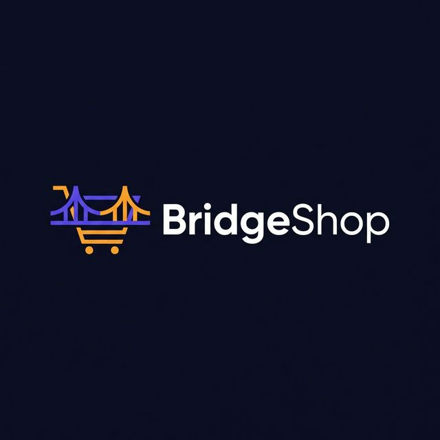
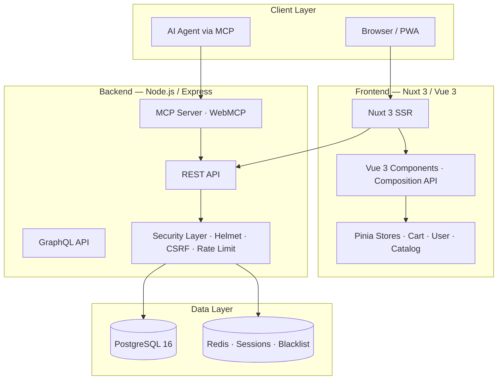

<div align="center">



# BridgeShop

**Enterprise-Grade E-Commerce Platform**

[](https://www.gnu.org/licenses/gpl-3.0)
[](https://vuejs.org/)
[](https://nuxt.com/)
[](https://nodejs.org/)
[](https://www.postgresql.org/)
[](https://www.typescriptlang.org/)

> **Created and led by [Douglas Puente](https://github.com/douglasdevsec)** — Systems Engineer & Cybersecurity Specialist

</div>

---

## 📖 About BridgeShop

**BridgeShop** is a modern, security-first, AI-ready e-commerce platform built on three pillars:

1. **Performance** — Vue 3 + Nuxt 3 SSR for sub-second page loads, perfect Core Web Vitals and clean UX inspired by the best e-commerce platforms.
2. **Security** — Hardened backend with OWASP Top 10 mitigations, prepared statements, rate limiting, strict CSP, JWT rotation and Redis-backed sessions.
3. **Intelligence** — Native WebMCP (Model Context Protocol) integration allowing AI agents to query the catalog, check stock and manage carts via JSON-RPC 2.0.

---

## 🏛️ Open Source Foundation

> BridgeShop was built upon the original open-source **[EverShop](https://github.com/evershopcommerce/evershop)** project, created by [The Nguyen](https://evershop.io).
>
> **Important:** The codebase has been **completely refactored** by Douglas Puente into a new technology stack. All frontend, security, DevOps and AEO layers have been rewritten from scratch. The original project's license (GPL-3.0) is preserved and credited below.
>
> Thank you to the EverShop contributors for providing a solid foundation.

| | Original (EverShop) | BridgeShop |
|-|---------------------|------------|
| **Frontend** | React 17 + Webpack 5 | **Vue 3 + Nuxt 3 (SSR)** |
| **State** | Custom (urql) | **Pinia** |
| **Sessions** | session-file-store | **Redis** |
| **Validation** | AJV | **Zod + vee-validate** |
| **Security** | Basic | **Helmet, CSRF, Rate Limiting, Argon2** |
| **AI Agents** | ❌ | **WebMCP (MCP Protocol)** |
| **SEO** | Basic | **JSON-LD schema.org + sitemap** |

---

## 👤 Author & Leadership

| Role | 
|------|
| **Project Creator & Lead Architect** — Douglas Puente |
| **Security Architecture** — OWASP Top 10 · Defensive Security |
| **AEO / SEO Strategy** — WebMCP · schema.org · JSON-LD |
| **GitHub** — [douglasdevsec](https://github.com/douglasdevsec) |

---

## 🏗️ Architecture



---

## 🛠️ Tech Stack

| Layer | Technology | Version |
|-------|-----------|---------|
| **Frontend** | Vue 3 · Nuxt 3 · Pinia · Vite | 3.x · 3.15 |
| **UI System** | Nuxt UI · Tailwind · lucide-vue-next | — |
| **Forms** | vee-validate + Zod | 4.x |
| **Backend** | Node.js · Express · GraphQL Yoga | 20 LTS |
| **Database** | PostgreSQL 16 | 16 |
| **Cache/Sessions** | Redis 7 | 7 |
| **Security** | Helmet · csrf-csrf · express-rate-limit | — |
| **AI/AEO** | Model Context Protocol (MCP SDK) | 1.x |
| **SEO** | nuxt-schema-org · sitemap · robots | — |
| **Tests** | Vitest · @vue/test-utils · Playwright | 2.x |
| **CI/CD** | GitHub Actions | — |

---

## 🔒 Security Features

- ✅ SQL Injection — 100% parameterized queries (Zod + pg driver)
- ✅ XSS — Strict CSP with nonces, output encoding
- ✅ Clickjacking — `X-Frame-Options: DENY` + `frame-ancestors 'none'`
- ✅ CSRF — Double-submit cookie (`csrf-csrf`)
- ✅ Sessions — HttpOnly + SameSite=Strict + Secure + Redis store
- ✅ Auth — JWT rotation, refresh tokens, Redis blacklist
- ✅ Rate Limiting — Auth 5/min, Checkout 10/min, progressive slow-down
- ✅ Headers — HSTS, Permissions-Policy, Referrer-Policy via Helmet

---

## 🚀 Getting Started

### With Docker (recommended)

```bash
git clone https://github.com/douglasdevsec/bridgeshop.git
cd bridgeshop
cp .env.example .env       # fill in your values
docker-compose up -d       # starts app + PostgreSQL 16 + Redis 7
npm run db:migrate
npm run db:seed
```

→ Storefront: **http://localhost:3000**  
→ Admin: **http://localhost:3000/admin**

### Manual

```bash
npm install
createdb bridgeshop
npm run db:migrate && npm run db:seed
npm run dev
```

---

## 🤖 AI Agent Integration (WebMCP)

```json
// GET /mcp — discovery manifest
{
  "name": "BridgeShop",
  "auth": { "type": "api_key", "header": "X-BridgeShop-Agent-Key" },
  "tools": ["search_products", "check_stock", "manage_cart"]
}
```

---

## 🗺️ Roadmap

See [`TASK_PLAN.md`](./TASK_PLAN.md) for the full phase-by-phase plan.

| Phase | Status |
|-------|--------|
| Phase 1 — Init, rename, GitHub | ✅ Complete |
| Phase 2 — Vue 3 / Nuxt 3 Frontend | ✅ Complete |
| Phase 3 — Security Hardening | 🔄 In Progress |
| Phase 4 — WebMCP + SEO | ⏳ Pending |

---

## 📄 License

**GNU General Public License v3.0** — See [`LICENSE`](./LICENSE).

Original EverShop code is licensed under GPL-3.0 © The Nguyen / EverShop Contributors.  
BridgeShop refactor © 2025 Douglas Puente.

---

<div align="center">
Built with ❤️ by <strong>Douglas Puente</strong> · <a href="https://github.com/douglasdevsec">@douglasdevsec</a>
</div>
